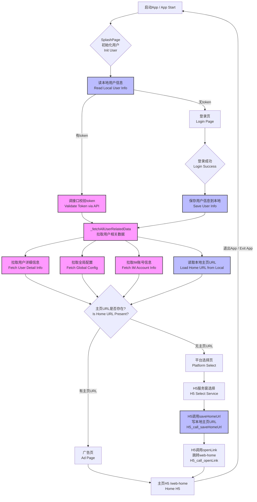

# Flutter设备接口实现总结

## 概述

本文档总结了Flutter项目中新增的设备接口实现，用于与Android原生代码保持一致。

## 新增功能

### 1. 应用启动功能

**文件**: `lib/services/app_launcher_service.dart`

**功能**:
- 检查应用是否已安装
- 启动指定包名的应用
- 获取当前应用信息
- 打开应用商店

**对应Android方法**: `launchApp`

### 2. 蓝牙功能

**文件**: `lib/services/bluetooth_service.dart`

**功能**:
- 检查蓝牙是否支持
- 检查蓝牙是否开启
- 检查蓝牙权限
- 扫描蓝牙设备
- 连接蓝牙设备
- 断开蓝牙设备
- 发送数据到蓝牙设备
- 监听蓝牙设备数据

**对应Android方法**:
- `checkBtEnable`
- `getBtDeviceList`
- `connectToBtDevice`
- `disconnectBtDevice`

## 修复的问题

### 1. startRecord方法
**问题**: msg字段不一致
**修复**: 将msg从空字符串改为"操作成功"

### 2. getUserInfo方法
**问题**: 返回数据结构不一致
**修复**: 返回`data.phone`而不是完整的userInfo对象

### 3. getSessionStorage方法
**问题**: 字段名不一致
**修复**: 使用正确的字段名（tokenId, mobile, eid）

## 新增依赖

```yaml
# 蓝牙功能
flutter_blue_plus: ^1.31.15

# 应用启动
app_launcher: ^1.0.0

# 包管理器
package_info_plus: ^8.0.2
```

## 权限配置

### Android权限
在 `android/app/src/main/AndroidManifest.xml` 中添加：
```xml
<!-- 蓝牙权限 -->
<uses-permission android:name="android.permission.BLUETOOTH" />
<uses-permission android:name="android.permission.BLUETOOTH_ADMIN" />
<uses-permission android:name="android.permission.BLUETOOTH_SCAN" />
<uses-permission android:name="android.permission.BLUETOOTH_CONNECT" />
<uses-permission android:name="android.permission.ACCESS_FINE_LOCATION" />
<uses-permission android:name="android.permission.ACCESS_COARSE_LOCATION" />

<!-- 蓝牙功能声明 -->
<uses-feature android:name="android.hardware.bluetooth_le" android:required="true" />
```

## 实现的方法列表

### 已实现的方法
1. ✅ `launchApp` - 启动应用
2. ✅ `checkBtEnable` - 检查蓝牙是否可用
3. ✅ `getBtDeviceList` - 获取蓝牙设备列表
4. ✅ `connectToBtDevice` - 连接蓝牙设备
5. ✅ `disconnectBtDevice` - 断开蓝牙设备

### 仍缺失的方法
1. ❌ `chooseMobileContacts` - 选择手机联系人
2. ❌ `saveMobileContacts` - 保存手机联系人

## 返回格式一致性

所有新增方法都遵循与Android代码一致的返回格式：

```json
{
  "status": "success|fail",
  "msg": "操作结果描述",
  "data": {}
}
```

## 错误处理

所有方法都包含完整的错误处理机制：
- 参数验证
- 异常捕获
- 详细的错误信息返回

## 测试建议

1. **蓝牙功能测试**:
   - 在真机上测试蓝牙扫描
   - 测试蓝牙设备连接和断开
   - 验证权限请求流程

2. **应用启动测试**:
   - 测试启动已安装的应用
   - 测试启动未安装的应用
   - 验证错误处理

3. **兼容性测试**:
   - 测试不同Android版本
   - 测试不同设备型号
   - 验证权限处理

## 后续优化建议

1. **蓝牙功能增强**:
   - 添加蓝牙数据监听
   - 实现数据发送功能
   - 优化连接稳定性

2. **联系人功能**:
   - 实现联系人选择
   - 实现联系人保存
   - 添加权限处理

3. **错误处理优化**:
   - 添加更详细的错误码
   - 实现重试机制
   - 优化用户体验

## 文件结构

```
lib/
├── services/
│   ├── app_launcher_service.dart    # 应用启动服务
│   ├── bluetooth_service.dart       # 蓝牙服务
│   └── user_service.dart            # 用户服务
├── utils/
│   └── bridge/
│       └── jssdk_handlers.dart      # JSSDK处理器
└── models/
    └── user.dart                    # 用户模型
```

## 注意事项

1. **蓝牙功能**: 需要设备支持BLE
2. **权限处理**: 首次使用时会请求相关权限
3. **设备兼容性**: 不同设备可能有差异
4. **错误处理**: 所有方法都有完整的错误处理

## 总结

通过本次实现，Flutter项目已经基本与Android原生代码保持一致，新增了应用启动和蓝牙功能，修复了返回格式不一致的问题。剩余的联系人功能可以根据需要后续实现。

## APP启动与用户数据加载流程图

以下流程图详细描述了 APP 启动、登录、用户数据加载、主页跳转的完整流程，并特别展开了 `_fetchAllUserRelatedData` 方法的内部步骤：



### 说明
- `_fetchAllUserRelatedData` 会并发执行以下四步：
  1. 拉取用户详细信息（接口）
  2. 拉取全局配置（接口）
  3. 拉取IM账号信息（接口）
  4. 读取本地保存的主页URL（本地缓存）
- 这四步全部完成后，判断是否有主页URL，决定后续进入广告页/主页还是平台选择页。 